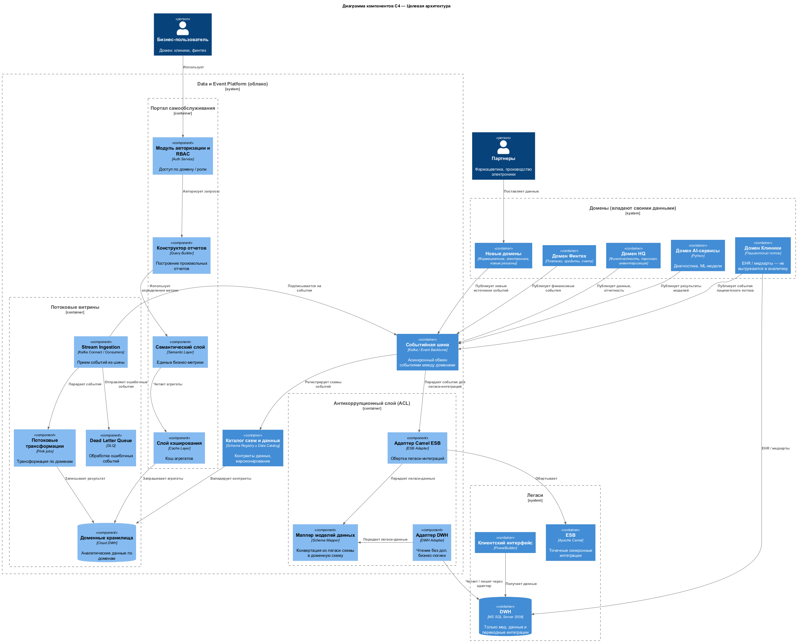
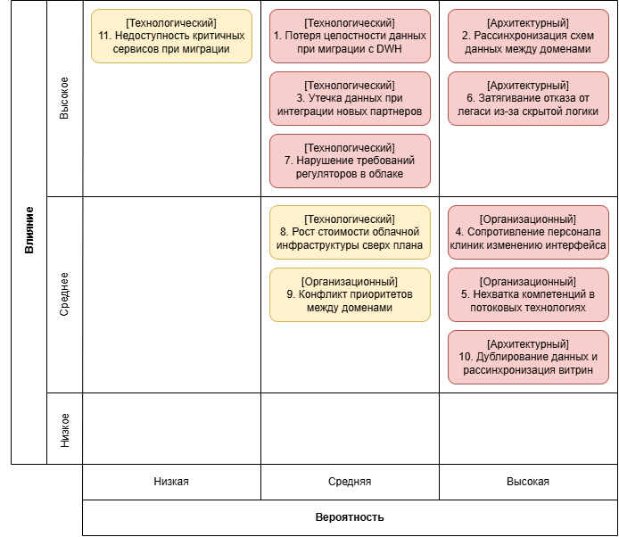
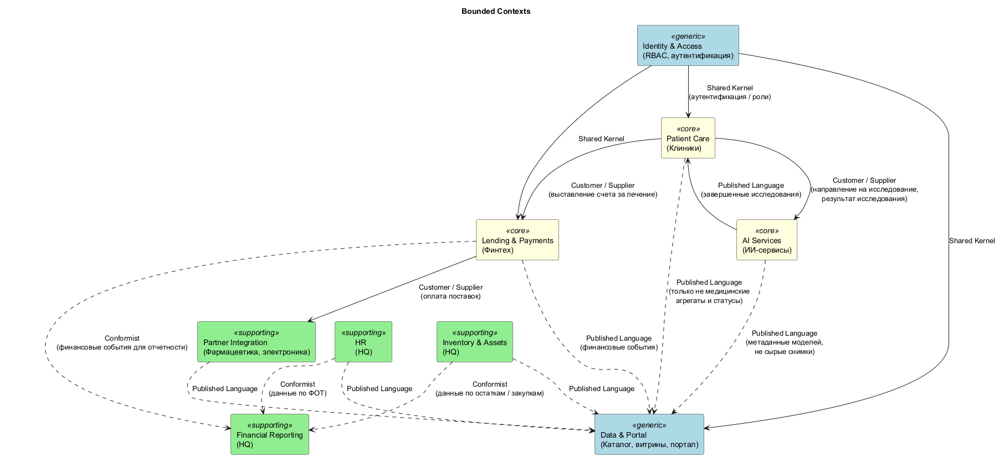
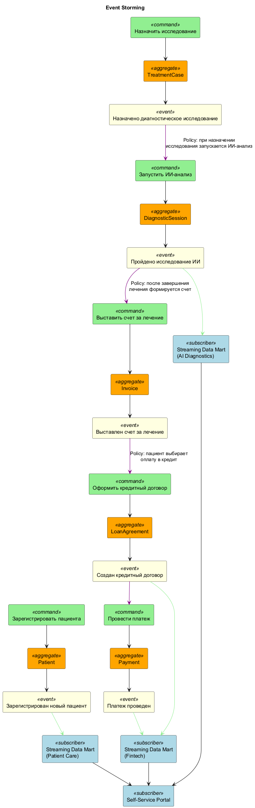

# Проектная работа

## Задание 1

[Описание модуля Terraform](Task1Advanced/README.md)

## Задание 2

[Описание Terraform Backends и GitLab CI](Task2Advanced/README.md)

## Задание 3

[План управления рисками](Task3Advanced/risk-management-plan.md)

## Задание 4

[Каталог агрегатов](Task4Advanced/aggregates.md)

[Каталог доменных событий](Task4Advanced/events.md)

[Обоснование событийного подхода vs Camel / DWH](Task4Advanced/justification.md)

## Задание 5

[Технический радар](Task5Advanced/tech-radar.md)

[Экономическое обоснование трансформации](Task5Advanced/tco-analysis.md)

[Стратегический роадмap внедрения Data Mesh](Task5Advanced/roadmap.md)
